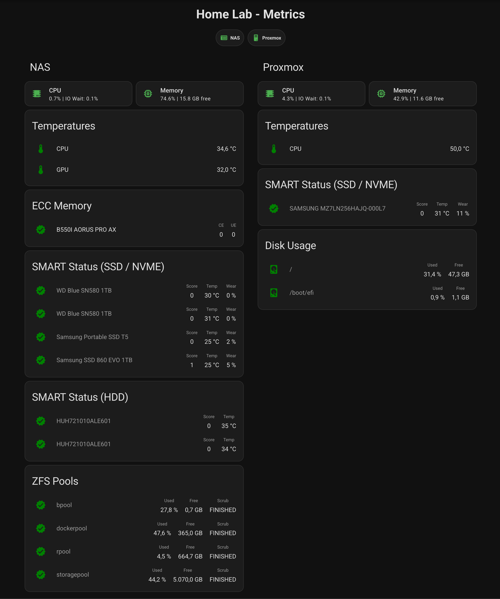

# linux2mqtt

This is a personal fork of [miaucl/linux2mqtt](https://github.com/miaucl/linux2mqtt).

Publish linux system performance metrics to a MQTT broker with Home Assistant MQTT Discovery support.

Minimum required python version: 3.12

## Install

```shell
pip install git+https://github.com/mietzen/linux2mqtt.git
```

## Usage

```shell
linux2mqtt --name <NAME> --host <MQTT_HOST> [OPTIONS]
```

### Options

| Option | Description | Default |
| --- | --- | --- |
| `--name` | Friendly name for the system | hostname |
| `--host` | MQTT broker hostname/IP | `MQTT_HOST` env or localhost |
| `--port` | MQTT broker port | `1883` |
| `--username` | MQTT username | `MQTT_USER` env |
| `--password` | MQTT password | `MQTT_PASSWORD` env |
| `--interval` | Publish interval in seconds | `30` |
| `--cpu` | CPU utilization (optional: collection interval) | - |
| `--vm` | Virtual memory | - |
| `--du` | Disk usage (repeatable, e.g. `--du='/'`) | - |
| `--net` | Network interface (e.g. `--net=eth0,15`) | - |
| `--connections` | Network connections | - |
| `--temp` | Thermal zone temperatures | - |
| `--fan` | Fan speeds | - |
| `--harddrives` | Hard drive SMART stats (requires `smartctl`) | - |
| `--zpools` | ZFS pool stats (requires `zpool`) | - |
| `--ecc` | ECC memory errors (requires `edac-util`) | - |
| `--packages` | Available package updates | - |
| `--discovery` | Discovery platform (default: `homeassistant`) | - |
| `-v` | Log verbosity (repeat for more, e.g. `-vvvvv`) | `0` |
| `--logdir` | Log to directory | - |

### Examples

```shell
# Basic CPU and memory monitoring:
linux2mqtt --name MyServer --host 192.168.1.100 --cpu=60 --vm -vvvvv

# Full monitoring with all features:
linux2mqtt --name NAS --host 192.168.1.100 --cpu=60 --vm \
  --du='/' --du='/mnt/storage' \
  --temp --harddrives --zpools --ecc \
  --net=eth0,15 --connections -vvvvv

# Multiple disk usage volumes:
linux2mqtt --name Server1 --host 192.168.1.100 --du='/' --du='/var/spool'
```

## Systemd Service

```ini
[Unit]
Description=linux2mqtt
After=network-online.target
Wants=network-online.target

[Service]
EnvironmentFile=/etc/linux2mqtt.conf
ExecStart=/opt/linux2mqtt/venv/bin/linux2mqtt \
  --name MyServer \
  --host 192.168.1.100 \
  --cpu=60 --vm \
  --du='/' \
  --temp --harddrives \
  -vvvvv
Restart=on-failure
RestartSec=30
AmbientCapabilities=CAP_SYS_RAWIO CAP_SYS_ADMIN # CAP_SYS_ADMIN is only needed for NVME-Drives

[Install]
WantedBy=multi-user.target
```

`/etc/linux2mqtt.conf`:

```shell
MQTT_HOST=192.168.1.100
MQTT_USER=myuser
MQTT_PASSWORD=mypassword
```

## Hard Drive SMART Scoring

Requires `smartctl`. Each drive gets a score that maps to a status:

| Status | Score |
| --- | --- |
| HEALTHY | <= 10 |
| GOOD | <= 20 |
| WARNING | <= 50 |
| FAILING | > 50 |

Supports ATA (HDD & SSD) and NVMe drives. SATA SSDs are auto-detected via `rotation_rate` and wear is tracked using `Wear_Leveling_Count`.

## ZFS Pool Monitoring

Requires `zpool` with JSON support (`zpool status -j`). Auto-discovers all pools and reports:

- Pool state, capacity (allocated/total/free/percent)
- Scrub status and errors
- Leaf disk read/write/checksum errors (summed recursively)
- Degraded device count

Same scoring system as hard drives.

## ECC Memory Monitoring

Requires `edac-util`. Reports correctable (CE) and uncorrectable (UE) error counts.

## Home Assistant Dashboard

An example dashboard using [HACS](https://hacs.xyz/) cards (auto-entities, mushroom, card-mod, multiple-entity-row) is provided in [examples/ha_dashboard.yaml](examples/ha_dashboard.yaml).



## Credits

- [miaucl/linux2mqtt](https://github.com/miaucl/linux2mqtt) - Original project
- [bimal12/linux2mqtt](https://github.com/bimal12/linux2mqtt) - Hard drive SMART monitoring
